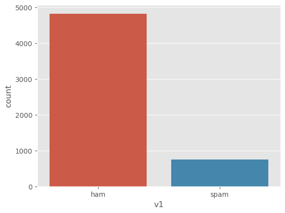
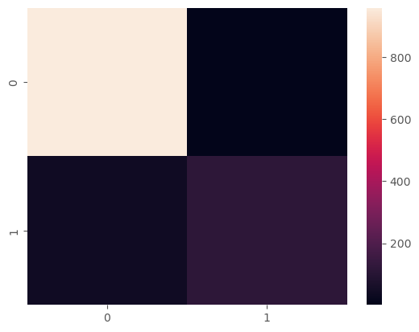

```python
import pandas as pd 
import numpy as np
import seaborn as sns
import matplotlib.pyplot as plt
```


```python
data = pd.read_csv("spam_mails.csv")
```


```python
data
```


<div>
<style scoped>
    .dataframe tbody tr th:only-of-type {
        vertical-align: middle;
    }

    .dataframe tbody tr th {
        vertical-align: top;
    }

    .dataframe thead th {
        text-align: right;
    }
</style>
<table border="1" class="dataframe">
  <thead>
    <tr style="text-align: right;">
      <th></th>
      <th>v1</th>
      <th>v2</th>
      <th>Unnamed: 2</th>
      <th>Unnamed: 3</th>
      <th>Unnamed: 4</th>
    </tr>
  </thead>
  <tbody>
    <tr>
      <th>0</th>
      <td>ham</td>
      <td>Go until jurong point, crazy.. Available only ...</td>
      <td>NaN</td>
      <td>NaN</td>
      <td>NaN</td>
    </tr>
    <tr>
      <th>1</th>
      <td>ham</td>
      <td>Ok lar... Joking wif u oni...</td>
      <td>NaN</td>
      <td>NaN</td>
      <td>NaN</td>
    </tr>
    <tr>
      <th>2</th>
      <td>spam</td>
      <td>Free entry in 2 a wkly comp to win FA Cup fina...</td>
      <td>NaN</td>
      <td>NaN</td>
      <td>NaN</td>
    </tr>
    <tr>
      <th>3</th>
      <td>ham</td>
      <td>U dun say so early hor... U c already then say...</td>
      <td>NaN</td>
      <td>NaN</td>
      <td>NaN</td>
    </tr>
    <tr>
      <th>4</th>
      <td>ham</td>
      <td>Nah I don't think he goes to usf, he lives aro...</td>
      <td>NaN</td>
      <td>NaN</td>
      <td>NaN</td>
    </tr>
    <tr>
      <th>...</th>
      <td>...</td>
      <td>...</td>
      <td>...</td>
      <td>...</td>
      <td>...</td>
    </tr>
    <tr>
      <th>5567</th>
      <td>spam</td>
      <td>This is the 2nd time we have tried 2 contact u...</td>
      <td>NaN</td>
      <td>NaN</td>
      <td>NaN</td>
    </tr>
    <tr>
      <th>5568</th>
      <td>ham</td>
      <td>Will Ì_ b going to esplanade fr home?</td>
      <td>NaN</td>
      <td>NaN</td>
      <td>NaN</td>
    </tr>
    <tr>
      <th>5569</th>
      <td>ham</td>
      <td>Pity, * was in mood for that. So...any other s...</td>
      <td>NaN</td>
      <td>NaN</td>
      <td>NaN</td>
    </tr>
    <tr>
      <th>5570</th>
      <td>ham</td>
      <td>The guy did some bitching but I acted like i'd...</td>
      <td>NaN</td>
      <td>NaN</td>
      <td>NaN</td>
    </tr>
    <tr>
      <th>5571</th>
      <td>ham</td>
      <td>Rofl. Its true to its name</td>
      <td>NaN</td>
      <td>NaN</td>
      <td>NaN</td>
    </tr>
  </tbody>
</table>
<p>5572 rows × 5 columns</p>
</div>


```python
data = data.drop(["Unnamed: 2" , "Unnamed: 3" , "Unnamed: 4"] , axis=1)
```


```python
data
```


<div>
<style scoped>
    .dataframe tbody tr th:only-of-type {
        vertical-align: middle;
    }

    .dataframe tbody tr th {
        vertical-align: top;
    }

    .dataframe thead th {
        text-align: right;
    }
</style>
<table border="1" class="dataframe">
  <thead>
    <tr style="text-align: right;">
      <th></th>
      <th>v1</th>
      <th>v2</th>
    </tr>
  </thead>
  <tbody>
    <tr>
      <th>0</th>
      <td>ham</td>
      <td>Go until jurong point, crazy.. Available only ...</td>
    </tr>
    <tr>
      <th>1</th>
      <td>ham</td>
      <td>Ok lar... Joking wif u oni...</td>
    </tr>
    <tr>
      <th>2</th>
      <td>spam</td>
      <td>Free entry in 2 a wkly comp to win FA Cup fina...</td>
    </tr>
    <tr>
      <th>3</th>
      <td>ham</td>
      <td>U dun say so early hor... U c already then say...</td>
    </tr>
    <tr>
      <th>4</th>
      <td>ham</td>
      <td>Nah I don't think he goes to usf, he lives aro...</td>
    </tr>
    <tr>
      <th>...</th>
      <td>...</td>
      <td>...</td>
    </tr>
    <tr>
      <th>5567</th>
      <td>spam</td>
      <td>This is the 2nd time we have tried 2 contact u...</td>
    </tr>
    <tr>
      <th>5568</th>
      <td>ham</td>
      <td>Will Ì_ b going to esplanade fr home?</td>
    </tr>
    <tr>
      <th>5569</th>
      <td>ham</td>
      <td>Pity, * was in mood for that. So...any other s...</td>
    </tr>
    <tr>
      <th>5570</th>
      <td>ham</td>
      <td>The guy did some bitching but I acted like i'd...</td>
    </tr>
    <tr>
      <th>5571</th>
      <td>ham</td>
      <td>Rofl. Its true to its name</td>
    </tr>
  </tbody>
</table>
<p>5572 rows × 2 columns</p>
</div>


```python
data["v1"].value_counts()
```


    v1
    ham     4825
    spam     747
    Name: count, dtype: int64


```python
print("Have any messing values ?\n " , data.isnull().values.any())
```

    Have any messing values ?
      False
    


```python
data.info()
```

    <class 'pandas.core.frame.DataFrame'>
    RangeIndex: 5572 entries, 0 to 5571
    Data columns (total 2 columns):
     #   Column  Non-Null Count  Dtype 
    ---  ------  --------------  ----- 
     0   v1      5572 non-null   object
     1   v2      5572 non-null   object
    dtypes: object(2)
    memory usage: 87.2+ KB
    


```python
data.describe(include="all")
```


<div>
<style scoped>
    .dataframe tbody tr th:only-of-type {
        vertical-align: middle;
    }

    .dataframe tbody tr th {
        vertical-align: top;
    }

    .dataframe thead th {
        text-align: right;
    }
</style>
<table border="1" class="dataframe">
  <thead>
    <tr style="text-align: right;">
      <th></th>
      <th>v1</th>
      <th>v2</th>
    </tr>
  </thead>
  <tbody>
    <tr>
      <th>count</th>
      <td>5572</td>
      <td>5572</td>
    </tr>
    <tr>
      <th>unique</th>
      <td>2</td>
      <td>5169</td>
    </tr>
    <tr>
      <th>top</th>
      <td>ham</td>
      <td>Sorry, I'll call later</td>
    </tr>
    <tr>
      <th>freq</th>
      <td>4825</td>
      <td>30</td>
    </tr>
  </tbody>
</table>
</div>


```python
sns.countplot(x="v1" ,data=data)
plt.style.use('ggplot')
plt.show()
```


    

    


```python
y=data["v1"]
```


```python
y
```


    0        ham
    1        ham
    2       spam
    3        ham
    4        ham
            ... 
    5567    spam
    5568     ham
    5569     ham
    5570     ham
    5571     ham
    Name: v1, Length: 5572, dtype: object


```python
from sklearn.preprocessing  import LabelEncoder
```


```python
y_encoded = LabelEncoder().fit_transform(y)
```


```python
y_encoded
```


    array([0, 0, 1, ..., 0, 0, 0])


- 0-------ham
- 1-------spam


```python
x = data["v2"]
```


```python
x
```


    0       Go until jurong point, crazy.. Available only ...
    1                           Ok lar... Joking wif u oni...
    2       Free entry in 2 a wkly comp to win FA Cup fina...
    3       U dun say so early hor... U c already then say...
    4       Nah I don't think he goes to usf, he lives aro...
                                  ...                        
    5567    This is the 2nd time we have tried 2 contact u...
    5568                Will Ì_ b going to esplanade fr home?
    5569    Pity, * was in mood for that. So...any other s...
    5570    The guy did some bitching but I acted like i'd...
    5571                           Rofl. Its true to its name
    Name: v2, Length: 5572, dtype: object


```python
from sklearn.model_selection import train_test_split
```


```python
x_train , x_test , y_train , y_test = train_test_split(x , y ,test_size=0.2  , random_state=3 , shuffle=True)
```

# Change string Values to integers


```python
from sklearn.feature_extraction.text import TfidfVectorizer
```


```python
feature_extraction = TfidfVectorizer(min_df=1 , stop_words="english" , lowercase=True)
```


```python
x_train_featured = feature_extraction.fit_transform(x_train)
x_test_featured = feature_extraction.transform(x_test)
```


```python
x_train_featured
```


    <4457x7511 sparse matrix of type '<class 'numpy.float64'>'
    	with 34759 stored elements in Compressed Sparse Row format>


```python
y_train_encoded = LabelEncoder().fit_transform(y_train)
y_test_encoded = LabelEncoder().fit_transform(y_test)
```


```python
y_test_encoded
```


    array([0, 1, 0, ..., 0, 0, 1])


```python
y_train_encoded
```


    array([0, 0, 0, ..., 0, 0, 0])


# Model1 "Using Logistic Regression"


```python
from sklearn.linear_model import LogisticRegression
```


```python
model_1=LogisticRegression()
```


```python
model_1.fit(x_train_featured , y_train_encoded)
```


<style>#sk-container-id-1 {color: black;}#sk-container-id-1 pre{padding: 0;}#sk-container-id-1 div.sk-toggleable {background-color: white;}#sk-container-id-1 label.sk-toggleable__label {cursor: pointer;display: block;width: 100%;margin-bottom: 0;padding: 0.3em;box-sizing: border-box;text-align: center;}#sk-container-id-1 label.sk-toggleable__label-arrow:before {content: "▸";float: left;margin-right: 0.25em;color: #696969;}#sk-container-id-1 label.sk-toggleable__label-arrow:hover:before {color: black;}#sk-container-id-1 div.sk-estimator:hover label.sk-toggleable__label-arrow:before {color: black;}#sk-container-id-1 div.sk-toggleable__content {max-height: 0;max-width: 0;overflow: hidden;text-align: left;background-color: #f0f8ff;}#sk-container-id-1 div.sk-toggleable__content pre {margin: 0.2em;color: black;border-radius: 0.25em;background-color: #f0f8ff;}#sk-container-id-1 input.sk-toggleable__control:checked~div.sk-toggleable__content {max-height: 200px;max-width: 100%;overflow: auto;}#sk-container-id-1 input.sk-toggleable__control:checked~label.sk-toggleable__label-arrow:before {content: "▾";}#sk-container-id-1 div.sk-estimator input.sk-toggleable__control:checked~label.sk-toggleable__label {background-color: #d4ebff;}#sk-container-id-1 div.sk-label input.sk-toggleable__control:checked~label.sk-toggleable__label {background-color: #d4ebff;}#sk-container-id-1 input.sk-hidden--visually {border: 0;clip: rect(1px 1px 1px 1px);clip: rect(1px, 1px, 1px, 1px);height: 1px;margin: -1px;overflow: hidden;padding: 0;position: absolute;width: 1px;}#sk-container-id-1 div.sk-estimator {font-family: monospace;background-color: #f0f8ff;border: 1px dotted black;border-radius: 0.25em;box-sizing: border-box;margin-bottom: 0.5em;}#sk-container-id-1 div.sk-estimator:hover {background-color: #d4ebff;}#sk-container-id-1 div.sk-parallel-item::after {content: "";width: 100%;border-bottom: 1px solid gray;flex-grow: 1;}#sk-container-id-1 div.sk-label:hover label.sk-toggleable__label {background-color: #d4ebff;}#sk-container-id-1 div.sk-serial::before {content: "";position: absolute;border-left: 1px solid gray;box-sizing: border-box;top: 0;bottom: 0;left: 50%;z-index: 0;}#sk-container-id-1 div.sk-serial {display: flex;flex-direction: column;align-items: center;background-color: white;padding-right: 0.2em;padding-left: 0.2em;position: relative;}#sk-container-id-1 div.sk-item {position: relative;z-index: 1;}#sk-container-id-1 div.sk-parallel {display: flex;align-items: stretch;justify-content: center;background-color: white;position: relative;}#sk-container-id-1 div.sk-item::before, #sk-container-id-1 div.sk-parallel-item::before {content: "";position: absolute;border-left: 1px solid gray;box-sizing: border-box;top: 0;bottom: 0;left: 50%;z-index: -1;}#sk-container-id-1 div.sk-parallel-item {display: flex;flex-direction: column;z-index: 1;position: relative;background-color: white;}#sk-container-id-1 div.sk-parallel-item:first-child::after {align-self: flex-end;width: 50%;}#sk-container-id-1 div.sk-parallel-item:last-child::after {align-self: flex-start;width: 50%;}#sk-container-id-1 div.sk-parallel-item:only-child::after {width: 0;}#sk-container-id-1 div.sk-dashed-wrapped {border: 1px dashed gray;margin: 0 0.4em 0.5em 0.4em;box-sizing: border-box;padding-bottom: 0.4em;background-color: white;}#sk-container-id-1 div.sk-label label {font-family: monospace;font-weight: bold;display: inline-block;line-height: 1.2em;}#sk-container-id-1 div.sk-label-container {text-align: center;}#sk-container-id-1 div.sk-container {/* jupyter's `normalize.less` sets `[hidden] { display: none; }` but bootstrap.min.css set `[hidden] { display: none !important; }` so we also need the `!important` here to be able to override the default hidden behavior on the sphinx rendered scikit-learn.org. See: https://github.com/scikit-learn/scikit-learn/issues/21755 */display: inline-block !important;position: relative;}#sk-container-id-1 div.sk-text-repr-fallback {display: none;}</style><div id="sk-container-id-1" class="sk-top-container"><div class="sk-text-repr-fallback"><pre>LogisticRegression()</pre><b>In a Jupyter environment, please rerun this cell to show the HTML representation or trust the notebook. <br />On GitHub, the HTML representation is unable to render, please try loading this page with nbviewer.org.</b></div><div class="sk-container" hidden><div class="sk-item"><div class="sk-estimator sk-toggleable"><input class="sk-toggleable__control sk-hidden--visually" id="sk-estimator-id-1" type="checkbox" checked><label for="sk-estimator-id-1" class="sk-toggleable__label sk-toggleable__label-arrow">LogisticRegression</label><div class="sk-toggleable__content"><pre>LogisticRegression()</pre></div></div></div></div></div>


```python
preds = model_1.predict(x_test_featured)
```


```python
preds
```


    array([0, 0, 0, ..., 0, 0, 0])


```python
comp_table = pd.DataFrame({
    "Actual Output":y_test_encoded , 
    "Preds Output": preds
})
```


```python
comp_table
```


<div>
<style scoped>
    .dataframe tbody tr th:only-of-type {
        vertical-align: middle;
    }

    .dataframe tbody tr th {
        vertical-align: top;
    }

    .dataframe thead th {
        text-align: right;
    }
</style>
<table border="1" class="dataframe">
  <thead>
    <tr style="text-align: right;">
      <th></th>
      <th>Actual Output</th>
      <th>Preds Output</th>
    </tr>
  </thead>
  <tbody>
    <tr>
      <th>0</th>
      <td>0</td>
      <td>0</td>
    </tr>
    <tr>
      <th>1</th>
      <td>1</td>
      <td>0</td>
    </tr>
    <tr>
      <th>2</th>
      <td>0</td>
      <td>0</td>
    </tr>
    <tr>
      <th>3</th>
      <td>0</td>
      <td>0</td>
    </tr>
    <tr>
      <th>4</th>
      <td>0</td>
      <td>0</td>
    </tr>
    <tr>
      <th>...</th>
      <td>...</td>
      <td>...</td>
    </tr>
    <tr>
      <th>1110</th>
      <td>0</td>
      <td>0</td>
    </tr>
    <tr>
      <th>1111</th>
      <td>0</td>
      <td>0</td>
    </tr>
    <tr>
      <th>1112</th>
      <td>0</td>
      <td>0</td>
    </tr>
    <tr>
      <th>1113</th>
      <td>0</td>
      <td>0</td>
    </tr>
    <tr>
      <th>1114</th>
      <td>1</td>
      <td>0</td>
    </tr>
  </tbody>
</table>
<p>1115 rows × 2 columns</p>
</div>


Evaluate the model


```python
from sklearn.metrics import confusion_matrix
from sklearn.metrics import f1_score
```


```python
print("The Accuracy of our model is :  " , f1_score(y_test_encoded , preds)*100 , "%")
```

    The Accuracy of our model is :   84.44444444444446 %
    


```python
matrix_accuracy1 = confusion_matrix(y_test_encoded , preds)
```


```python
matrix_accuracy1
```


    array([[959,   1],
           [ 41, 114]], dtype=int64)


```python
sns.heatmap(matrix_accuracy1)
```


    <Axes: >


    

    


# Using Another Model and compare the accuracy "KNN

How does it work?
K is the number of nearest neighbors to use. For classification, a majority vote is used to determined which class a new observation should fall into. Larger values of K are often more robust to outliers and produce more stable decision boundaries than very small values (K=3 would be better than K=1, which might produce undesirable results


```python
from sklearn.neighbors import KNeighborsClassifier
```


```python
model_2 = KNeighborsClassifier()
```


```python
model_2.fit(x_train_featured , y_train_encoded)
```


<style>#sk-container-id-3 {color: black;}#sk-container-id-3 pre{padding: 0;}#sk-container-id-3 div.sk-toggleable {background-color: white;}#sk-container-id-3 label.sk-toggleable__label {cursor: pointer;display: block;width: 100%;margin-bottom: 0;padding: 0.3em;box-sizing: border-box;text-align: center;}#sk-container-id-3 label.sk-toggleable__label-arrow:before {content: "▸";float: left;margin-right: 0.25em;color: #696969;}#sk-container-id-3 label.sk-toggleable__label-arrow:hover:before {color: black;}#sk-container-id-3 div.sk-estimator:hover label.sk-toggleable__label-arrow:before {color: black;}#sk-container-id-3 div.sk-toggleable__content {max-height: 0;max-width: 0;overflow: hidden;text-align: left;background-color: #f0f8ff;}#sk-container-id-3 div.sk-toggleable__content pre {margin: 0.2em;color: black;border-radius: 0.25em;background-color: #f0f8ff;}#sk-container-id-3 input.sk-toggleable__control:checked~div.sk-toggleable__content {max-height: 200px;max-width: 100%;overflow: auto;}#sk-container-id-3 input.sk-toggleable__control:checked~label.sk-toggleable__label-arrow:before {content: "▾";}#sk-container-id-3 div.sk-estimator input.sk-toggleable__control:checked~label.sk-toggleable__label {background-color: #d4ebff;}#sk-container-id-3 div.sk-label input.sk-toggleable__control:checked~label.sk-toggleable__label {background-color: #d4ebff;}#sk-container-id-3 input.sk-hidden--visually {border: 0;clip: rect(1px 1px 1px 1px);clip: rect(1px, 1px, 1px, 1px);height: 1px;margin: -1px;overflow: hidden;padding: 0;position: absolute;width: 1px;}#sk-container-id-3 div.sk-estimator {font-family: monospace;background-color: #f0f8ff;border: 1px dotted black;border-radius: 0.25em;box-sizing: border-box;margin-bottom: 0.5em;}#sk-container-id-3 div.sk-estimator:hover {background-color: #d4ebff;}#sk-container-id-3 div.sk-parallel-item::after {content: "";width: 100%;border-bottom: 1px solid gray;flex-grow: 1;}#sk-container-id-3 div.sk-label:hover label.sk-toggleable__label {background-color: #d4ebff;}#sk-container-id-3 div.sk-serial::before {content: "";position: absolute;border-left: 1px solid gray;box-sizing: border-box;top: 0;bottom: 0;left: 50%;z-index: 0;}#sk-container-id-3 div.sk-serial {display: flex;flex-direction: column;align-items: center;background-color: white;padding-right: 0.2em;padding-left: 0.2em;position: relative;}#sk-container-id-3 div.sk-item {position: relative;z-index: 1;}#sk-container-id-3 div.sk-parallel {display: flex;align-items: stretch;justify-content: center;background-color: white;position: relative;}#sk-container-id-3 div.sk-item::before, #sk-container-id-3 div.sk-parallel-item::before {content: "";position: absolute;border-left: 1px solid gray;box-sizing: border-box;top: 0;bottom: 0;left: 50%;z-index: -1;}#sk-container-id-3 div.sk-parallel-item {display: flex;flex-direction: column;z-index: 1;position: relative;background-color: white;}#sk-container-id-3 div.sk-parallel-item:first-child::after {align-self: flex-end;width: 50%;}#sk-container-id-3 div.sk-parallel-item:last-child::after {align-self: flex-start;width: 50%;}#sk-container-id-3 div.sk-parallel-item:only-child::after {width: 0;}#sk-container-id-3 div.sk-dashed-wrapped {border: 1px dashed gray;margin: 0 0.4em 0.5em 0.4em;box-sizing: border-box;padding-bottom: 0.4em;background-color: white;}#sk-container-id-3 div.sk-label label {font-family: monospace;font-weight: bold;display: inline-block;line-height: 1.2em;}#sk-container-id-3 div.sk-label-container {text-align: center;}#sk-container-id-3 div.sk-container {/* jupyter's `normalize.less` sets `[hidden] { display: none; }` but bootstrap.min.css set `[hidden] { display: none !important; }` so we also need the `!important` here to be able to override the default hidden behavior on the sphinx rendered scikit-learn.org. See: https://github.com/scikit-learn/scikit-learn/issues/21755 */display: inline-block !important;position: relative;}#sk-container-id-3 div.sk-text-repr-fallback {display: none;}</style><div id="sk-container-id-3" class="sk-top-container"><div class="sk-text-repr-fallback"><pre>KNeighborsClassifier()</pre><b>In a Jupyter environment, please rerun this cell to show the HTML representation or trust the notebook. <br />On GitHub, the HTML representation is unable to render, please try loading this page with nbviewer.org.</b></div><div class="sk-container" hidden><div class="sk-item"><div class="sk-estimator sk-toggleable"><input class="sk-toggleable__control sk-hidden--visually" id="sk-estimator-id-3" type="checkbox" checked><label for="sk-estimator-id-3" class="sk-toggleable__label sk-toggleable__label-arrow">KNeighborsClassifier</label><div class="sk-toggleable__content"><pre>KNeighborsClassifier()</pre></div></div></div></div></div>


```python
preds2 = model_2.predict(x_test_featured)
```


```python
preds2
```


    array([0, 0, 0, ..., 0, 0, 0])


```python
comp_table_model_2 = pd.DataFrame({
    "Actual Output":y_test_encoded , 
    "Preds Output": preds2
})
```


```python
comp_table_model_2
```


<div>
<style scoped>
    .dataframe tbody tr th:only-of-type {
        vertical-align: middle;
    }

    .dataframe tbody tr th {
        vertical-align: top;
    }

    .dataframe thead th {
        text-align: right;
    }
</style>
<table border="1" class="dataframe">
  <thead>
    <tr style="text-align: right;">
      <th></th>
      <th>Actual Output</th>
      <th>Preds Output</th>
    </tr>
  </thead>
  <tbody>
    <tr>
      <th>0</th>
      <td>0</td>
      <td>0</td>
    </tr>
    <tr>
      <th>1</th>
      <td>1</td>
      <td>0</td>
    </tr>
    <tr>
      <th>2</th>
      <td>0</td>
      <td>0</td>
    </tr>
    <tr>
      <th>3</th>
      <td>0</td>
      <td>0</td>
    </tr>
    <tr>
      <th>4</th>
      <td>0</td>
      <td>0</td>
    </tr>
    <tr>
      <th>...</th>
      <td>...</td>
      <td>...</td>
    </tr>
    <tr>
      <th>1110</th>
      <td>0</td>
      <td>0</td>
    </tr>
    <tr>
      <th>1111</th>
      <td>0</td>
      <td>0</td>
    </tr>
    <tr>
      <th>1112</th>
      <td>0</td>
      <td>0</td>
    </tr>
    <tr>
      <th>1113</th>
      <td>0</td>
      <td>0</td>
    </tr>
    <tr>
      <th>1114</th>
      <td>1</td>
      <td>0</td>
    </tr>
  </tbody>
</table>
<p>1115 rows × 2 columns</p>
</div>


```python
print("The Accuracy of our model is :  " , f1_score(y_test_encoded , preds2)*100 , "%")
```

    The Accuracy of our model is :   48.78048780487805 %
    


```python
matrix_accuracy2 = confusion_matrix(y_test_encoded , preds2)
```


```python
matrix_accuracy2
```


    array([[960,   0],
           [105,  50]], dtype=int64)


It's Bad !!!!

# Using Another Model "SVM"

How does Support Vector Machine Algorithm Work?
One reasonable choice for the best hyperplane in a Support Vector Machine (SVM) is the one that maximizes the separation margin between the two classes. The maximum-margin hyperplane, also referred to as the hard margin, is selected based on maximizing the distance between the hyperplane and the nearest data point on each side.


```python
from sklearn.svm import SVC
```


```python
model_3 = SVC(kernel='sigmoid')
```


```python
model_3.fit(x_train_featured,y_train_encoded)
```


<style>#sk-container-id-8 {color: black;}#sk-container-id-8 pre{padding: 0;}#sk-container-id-8 div.sk-toggleable {background-color: white;}#sk-container-id-8 label.sk-toggleable__label {cursor: pointer;display: block;width: 100%;margin-bottom: 0;padding: 0.3em;box-sizing: border-box;text-align: center;}#sk-container-id-8 label.sk-toggleable__label-arrow:before {content: "▸";float: left;margin-right: 0.25em;color: #696969;}#sk-container-id-8 label.sk-toggleable__label-arrow:hover:before {color: black;}#sk-container-id-8 div.sk-estimator:hover label.sk-toggleable__label-arrow:before {color: black;}#sk-container-id-8 div.sk-toggleable__content {max-height: 0;max-width: 0;overflow: hidden;text-align: left;background-color: #f0f8ff;}#sk-container-id-8 div.sk-toggleable__content pre {margin: 0.2em;color: black;border-radius: 0.25em;background-color: #f0f8ff;}#sk-container-id-8 input.sk-toggleable__control:checked~div.sk-toggleable__content {max-height: 200px;max-width: 100%;overflow: auto;}#sk-container-id-8 input.sk-toggleable__control:checked~label.sk-toggleable__label-arrow:before {content: "▾";}#sk-container-id-8 div.sk-estimator input.sk-toggleable__control:checked~label.sk-toggleable__label {background-color: #d4ebff;}#sk-container-id-8 div.sk-label input.sk-toggleable__control:checked~label.sk-toggleable__label {background-color: #d4ebff;}#sk-container-id-8 input.sk-hidden--visually {border: 0;clip: rect(1px 1px 1px 1px);clip: rect(1px, 1px, 1px, 1px);height: 1px;margin: -1px;overflow: hidden;padding: 0;position: absolute;width: 1px;}#sk-container-id-8 div.sk-estimator {font-family: monospace;background-color: #f0f8ff;border: 1px dotted black;border-radius: 0.25em;box-sizing: border-box;margin-bottom: 0.5em;}#sk-container-id-8 div.sk-estimator:hover {background-color: #d4ebff;}#sk-container-id-8 div.sk-parallel-item::after {content: "";width: 100%;border-bottom: 1px solid gray;flex-grow: 1;}#sk-container-id-8 div.sk-label:hover label.sk-toggleable__label {background-color: #d4ebff;}#sk-container-id-8 div.sk-serial::before {content: "";position: absolute;border-left: 1px solid gray;box-sizing: border-box;top: 0;bottom: 0;left: 50%;z-index: 0;}#sk-container-id-8 div.sk-serial {display: flex;flex-direction: column;align-items: center;background-color: white;padding-right: 0.2em;padding-left: 0.2em;position: relative;}#sk-container-id-8 div.sk-item {position: relative;z-index: 1;}#sk-container-id-8 div.sk-parallel {display: flex;align-items: stretch;justify-content: center;background-color: white;position: relative;}#sk-container-id-8 div.sk-item::before, #sk-container-id-8 div.sk-parallel-item::before {content: "";position: absolute;border-left: 1px solid gray;box-sizing: border-box;top: 0;bottom: 0;left: 50%;z-index: -1;}#sk-container-id-8 div.sk-parallel-item {display: flex;flex-direction: column;z-index: 1;position: relative;background-color: white;}#sk-container-id-8 div.sk-parallel-item:first-child::after {align-self: flex-end;width: 50%;}#sk-container-id-8 div.sk-parallel-item:last-child::after {align-self: flex-start;width: 50%;}#sk-container-id-8 div.sk-parallel-item:only-child::after {width: 0;}#sk-container-id-8 div.sk-dashed-wrapped {border: 1px dashed gray;margin: 0 0.4em 0.5em 0.4em;box-sizing: border-box;padding-bottom: 0.4em;background-color: white;}#sk-container-id-8 div.sk-label label {font-family: monospace;font-weight: bold;display: inline-block;line-height: 1.2em;}#sk-container-id-8 div.sk-label-container {text-align: center;}#sk-container-id-8 div.sk-container {/* jupyter's `normalize.less` sets `[hidden] { display: none; }` but bootstrap.min.css set `[hidden] { display: none !important; }` so we also need the `!important` here to be able to override the default hidden behavior on the sphinx rendered scikit-learn.org. See: https://github.com/scikit-learn/scikit-learn/issues/21755 */display: inline-block !important;position: relative;}#sk-container-id-8 div.sk-text-repr-fallback {display: none;}</style><div id="sk-container-id-8" class="sk-top-container"><div class="sk-text-repr-fallback"><pre>SVC(kernel=&#x27;sigmoid&#x27;)</pre><b>In a Jupyter environment, please rerun this cell to show the HTML representation or trust the notebook. <br />On GitHub, the HTML representation is unable to render, please try loading this page with nbviewer.org.</b></div><div class="sk-container" hidden><div class="sk-item"><div class="sk-estimator sk-toggleable"><input class="sk-toggleable__control sk-hidden--visually" id="sk-estimator-id-8" type="checkbox" checked><label for="sk-estimator-id-8" class="sk-toggleable__label sk-toggleable__label-arrow">SVC</label><div class="sk-toggleable__content"><pre>SVC(kernel=&#x27;sigmoid&#x27;)</pre></div></div></div></div></div>


```python
preds3=model_3.predict(x_test_featured)
```


```python
preds3
```


    array([0, 1, 0, ..., 0, 0, 0])


```python
comp_table_model_3 = pd.DataFrame({
    "Actual Output":y_test_encoded , 
    "Preds Output": preds3
})
```


```python
comp_table_model_3
```


<div>
<style scoped>
    .dataframe tbody tr th:only-of-type {
        vertical-align: middle;
    }

    .dataframe tbody tr th {
        vertical-align: top;
    }

    .dataframe thead th {
        text-align: right;
    }
</style>
<table border="1" class="dataframe">
  <thead>
    <tr style="text-align: right;">
      <th></th>
      <th>Actual Output</th>
      <th>Preds Output</th>
    </tr>
  </thead>
  <tbody>
    <tr>
      <th>0</th>
      <td>0</td>
      <td>0</td>
    </tr>
    <tr>
      <th>1</th>
      <td>1</td>
      <td>1</td>
    </tr>
    <tr>
      <th>2</th>
      <td>0</td>
      <td>0</td>
    </tr>
    <tr>
      <th>3</th>
      <td>0</td>
      <td>0</td>
    </tr>
    <tr>
      <th>4</th>
      <td>0</td>
      <td>0</td>
    </tr>
    <tr>
      <th>...</th>
      <td>...</td>
      <td>...</td>
    </tr>
    <tr>
      <th>1110</th>
      <td>0</td>
      <td>0</td>
    </tr>
    <tr>
      <th>1111</th>
      <td>0</td>
      <td>0</td>
    </tr>
    <tr>
      <th>1112</th>
      <td>0</td>
      <td>0</td>
    </tr>
    <tr>
      <th>1113</th>
      <td>0</td>
      <td>0</td>
    </tr>
    <tr>
      <th>1114</th>
      <td>1</td>
      <td>0</td>
    </tr>
  </tbody>
</table>
<p>1115 rows × 2 columns</p>
</div>


```python
print("The Accuracy of our model is :  " , f1_score(y_test_encoded , preds3)*100 , "%")
```

    The Accuracy of our model is :   93.15068493150685 %
    


```python
matrix_accuracy3 = confusion_matrix(y_test_encoded , preds3)
```


```python
matrix_accuracy3
```


    array([[959,   1],
           [ 19, 136]], dtype=int64)


It's more better !!!!!

# Using Neural Network To build Classification Model


```python
import tensorflow as tf
from tensorflow.keras import Sequential
from tensorflow.keras.layers import Dense
from tensorflow.keras.losses import BinaryCrossentropy
```


```python
model_4 = Sequential([
    Dense(units=15, activation='sigmoid', input_shape=(x_train_featured.shape[1],)),
    Dense(units=1, activation='sigmoid'),
])
model_4.summary()
```


<pre style="white-space:pre;overflow-x:auto;line-height:normal;font-family:Menlo,'DejaVu Sans Mono',consolas,'Courier New',monospace"><span style="font-weight: bold">Model: "sequential_3"</span>
</pre>


<pre style="white-space:pre;overflow-x:auto;line-height:normal;font-family:Menlo,'DejaVu Sans Mono',consolas,'Courier New',monospace">┏━━━━━━━━━━━━━━━━━━━━━━━━━━━━━━━━━━━━━━┳━━━━━━━━━━━━━━━━━━━━━━━━━━━━━┳━━━━━━━━━━━━━━━━━┓
┃<span style="font-weight: bold"> Layer (type)                         </span>┃<span style="font-weight: bold"> Output Shape                </span>┃<span style="font-weight: bold">         Param # </span>┃
┡━━━━━━━━━━━━━━━━━━━━━━━━━━━━━━━━━━━━━━╇━━━━━━━━━━━━━━━━━━━━━━━━━━━━━╇━━━━━━━━━━━━━━━━━┩
│ dense_9 (<span style="color: #0087ff; text-decoration-color: #0087ff">Dense</span>)                      │ (<span style="color: #00d7ff; text-decoration-color: #00d7ff">None</span>, <span style="color: #00af00; text-decoration-color: #00af00">15</span>)                  │         <span style="color: #00af00; text-decoration-color: #00af00">112,680</span> │
├──────────────────────────────────────┼─────────────────────────────┼─────────────────┤
│ dense_10 (<span style="color: #0087ff; text-decoration-color: #0087ff">Dense</span>)                     │ (<span style="color: #00d7ff; text-decoration-color: #00d7ff">None</span>, <span style="color: #00af00; text-decoration-color: #00af00">1</span>)                   │              <span style="color: #00af00; text-decoration-color: #00af00">16</span> │
└──────────────────────────────────────┴─────────────────────────────┴─────────────────┘
</pre>


<pre style="white-space:pre;overflow-x:auto;line-height:normal;font-family:Menlo,'DejaVu Sans Mono',consolas,'Courier New',monospace"><span style="font-weight: bold"> Total params: </span><span style="color: #00af00; text-decoration-color: #00af00">112,696</span> (440.22 KB)
</pre>


<pre style="white-space:pre;overflow-x:auto;line-height:normal;font-family:Menlo,'DejaVu Sans Mono',consolas,'Courier New',monospace"><span style="font-weight: bold"> Trainable params: </span><span style="color: #00af00; text-decoration-color: #00af00">112,696</span> (440.22 KB)
</pre>


<pre style="white-space:pre;overflow-x:auto;line-height:normal;font-family:Menlo,'DejaVu Sans Mono',consolas,'Courier New',monospace"><span style="font-weight: bold"> Non-trainable params: </span><span style="color: #00af00; text-decoration-color: #00af00">0</span> (0.00 B)
</pre>


```python
model_4.compile(loss='binary_crossentropy', optimizer='adam', metrics=['accuracy'])
model_4.fit(x_train_featured, y_train_encoded,validation_data=(x_test_featured , y_test_encoded), epochs=100)
```

    Epoch 1/100
    140/140 ━━━━━━━━━━━━━━━━━━━━ 1s 3ms/step - accuracy: 0.4859 - loss: 0.6823 - val_accuracy: 0.8610 - val_loss: 0.4517
    Epoch 2/100
    140/140 ━━━━━━━━━━━━━━━━━━━━ 0s 1ms/step - accuracy: 0.8637 - loss: 0.4192 - val_accuracy: 0.8610 - val_loss: 0.3680
    Epoch 3/100
    140/140 ━━━━━━━━━━━━━━━━━━━━ 0s 1ms/step - accuracy: 0.8633 - loss: 0.3550 - val_accuracy: 0.8610 - val_loss: 0.3358
    Epoch 4/100
    140/140 ━━━━━━━━━━━━━━━━━━━━ 0s 2ms/step - accuracy: 0.8650 - loss: 0.3206 - val_accuracy: 0.8610 - val_loss: 0.3105
    Epoch 5/100
    140/140 ━━━━━━━━━━━━━━━━━━━━ 0s 2ms/step - accuracy: 0.8740 - loss: 0.2828 - val_accuracy: 0.8610 - val_loss: 0.2843
    Epoch 6/100
    140/140 ━━━━━━━━━━━━━━━━━━━━ 0s 1ms/step - accuracy: 0.8652 - loss: 0.2653 - val_accuracy: 0.8619 - val_loss: 0.2566
    Epoch 7/100
    140/140 ━━━━━━━━━━━━━━━━━━━━ 0s 1ms/step - accuracy: 0.8735 - loss: 0.2331 - val_accuracy: 0.8771 - val_loss: 0.2284
    Epoch 8/100
    140/140 ━━━━━━━━━━━━━━━━━━━━ 0s 1ms/step - accuracy: 0.8940 - loss: 0.2116 - val_accuracy: 0.9094 - val_loss: 0.2015
    Epoch 9/100
    140/140 ━━━━━━━━━━━━━━━━━━━━ 0s 1ms/step - accuracy: 0.9271 - loss: 0.1797 - val_accuracy: 0.9336 - val_loss: 0.1759
    Epoch 10/100
    140/140 ━━━━━━━━━━━━━━━━━━━━ 0s 2ms/step - accuracy: 0.9375 - loss: 0.1613 - val_accuracy: 0.9435 - val_loss: 0.1538
    Epoch 11/100
    140/140 ━━━━━━━━━━━━━━━━━━━━ 0s 2ms/step - accuracy: 0.9543 - loss: 0.1365 - val_accuracy: 0.9543 - val_loss: 0.1350
    Epoch 12/100
    140/140 ━━━━━━━━━━━━━━━━━━━━ 0s 1ms/step - accuracy: 0.9736 - loss: 0.1050 - val_accuracy: 0.9659 - val_loss: 0.1196
    Epoch 13/100
    140/140 ━━━━━━━━━━━━━━━━━━━━ 0s 1ms/step - accuracy: 0.9745 - loss: 0.1005 - val_accuracy: 0.9731 - val_loss: 0.1070
    Epoch 14/100
    140/140 ━━━━━━━━━━━━━━━━━━━━ 0s 1ms/step - accuracy: 0.9816 - loss: 0.0817 - val_accuracy: 0.9776 - val_loss: 0.0967
    Epoch 15/100
    140/140 ━━━━━━━━━━━━━━━━━━━━ 0s 1ms/step - accuracy: 0.9807 - loss: 0.0760 - val_accuracy: 0.9803 - val_loss: 0.0885
    Epoch 16/100
    140/140 ━━━━━━━━━━━━━━━━━━━━ 0s 1ms/step - accuracy: 0.9874 - loss: 0.0642 - val_accuracy: 0.9812 - val_loss: 0.0814
    Epoch 17/100
    140/140 ━━━━━━━━━━━━━━━━━━━━ 0s 1ms/step - accuracy: 0.9888 - loss: 0.0560 - val_accuracy: 0.9830 - val_loss: 0.0758
    Epoch 18/100
    140/140 ━━━━━━━━━━━━━━━━━━━━ 0s 2ms/step - accuracy: 0.9893 - loss: 0.0530 - val_accuracy: 0.9830 - val_loss: 0.0711
    Epoch 19/100
    140/140 ━━━━━━━━━━━━━━━━━━━━ 0s 1ms/step - accuracy: 0.9926 - loss: 0.0421 - val_accuracy: 0.9830 - val_loss: 0.0671
    Epoch 20/100
    140/140 ━━━━━━━━━━━━━━━━━━━━ 0s 2ms/step - accuracy: 0.9912 - loss: 0.0447 - val_accuracy: 0.9839 - val_loss: 0.0637
    Epoch 21/100
    140/140 ━━━━━━━━━━━━━━━━━━━━ 0s 2ms/step - accuracy: 0.9961 - loss: 0.0351 - val_accuracy: 0.9830 - val_loss: 0.0609
    Epoch 22/100
    140/140 ━━━━━━━━━━━━━━━━━━━━ 0s 1ms/step - accuracy: 0.9950 - loss: 0.0315 - val_accuracy: 0.9830 - val_loss: 0.0585
    Epoch 23/100
    140/140 ━━━━━━━━━━━━━━━━━━━━ 0s 2ms/step - accuracy: 0.9958 - loss: 0.0291 - val_accuracy: 0.9830 - val_loss: 0.0565
    Epoch 24/100
    140/140 ━━━━━━━━━━━━━━━━━━━━ 0s 1ms/step - accuracy: 0.9953 - loss: 0.0269 - val_accuracy: 0.9830 - val_loss: 0.0546
    Epoch 25/100
    140/140 ━━━━━━━━━━━━━━━━━━━━ 0s 2ms/step - accuracy: 0.9976 - loss: 0.0219 - val_accuracy: 0.9830 - val_loss: 0.0531
    Epoch 26/100
    140/140 ━━━━━━━━━━━━━━━━━━━━ 0s 1ms/step - accuracy: 0.9967 - loss: 0.0208 - val_accuracy: 0.9830 - val_loss: 0.0519
    Epoch 27/100
    140/140 ━━━━━━━━━━━━━━━━━━━━ 0s 1ms/step - accuracy: 0.9964 - loss: 0.0192 - val_accuracy: 0.9839 - val_loss: 0.0508
    Epoch 28/100
    140/140 ━━━━━━━━━━━━━━━━━━━━ 0s 2ms/step - accuracy: 0.9971 - loss: 0.0201 - val_accuracy: 0.9839 - val_loss: 0.0498
    Epoch 29/100
    140/140 ━━━━━━━━━━━━━━━━━━━━ 0s 1ms/step - accuracy: 0.9970 - loss: 0.0192 - val_accuracy: 0.9839 - val_loss: 0.0490
    Epoch 30/100
    140/140 ━━━━━━━━━━━━━━━━━━━━ 0s 1ms/step - accuracy: 0.9969 - loss: 0.0184 - val_accuracy: 0.9839 - val_loss: 0.0482
    Epoch 31/100
    140/140 ━━━━━━━━━━━━━━━━━━━━ 0s 2ms/step - accuracy: 0.9978 - loss: 0.0146 - val_accuracy: 0.9857 - val_loss: 0.0476
    Epoch 32/100
    140/140 ━━━━━━━━━━━━━━━━━━━━ 0s 2ms/step - accuracy: 0.9949 - loss: 0.0167 - val_accuracy: 0.9857 - val_loss: 0.0469
    Epoch 33/100
    140/140 ━━━━━━━━━━━━━━━━━━━━ 0s 1ms/step - accuracy: 0.9968 - loss: 0.0129 - val_accuracy: 0.9857 - val_loss: 0.0464
    Epoch 34/100
    140/140 ━━━━━━━━━━━━━━━━━━━━ 0s 2ms/step - accuracy: 0.9977 - loss: 0.0122 - val_accuracy: 0.9857 - val_loss: 0.0460
    Epoch 35/100
    140/140 ━━━━━━━━━━━━━━━━━━━━ 0s 1ms/step - accuracy: 0.9991 - loss: 0.0088 - val_accuracy: 0.9857 - val_loss: 0.0455
    Epoch 36/100
    140/140 ━━━━━━━━━━━━━━━━━━━━ 0s 2ms/step - accuracy: 0.9987 - loss: 0.0098 - val_accuracy: 0.9857 - val_loss: 0.0454
    Epoch 37/100
    140/140 ━━━━━━━━━━━━━━━━━━━━ 0s 2ms/step - accuracy: 0.9985 - loss: 0.0099 - val_accuracy: 0.9857 - val_loss: 0.0450
    Epoch 38/100
    140/140 ━━━━━━━━━━━━━━━━━━━━ 0s 2ms/step - accuracy: 0.9978 - loss: 0.0095 - val_accuracy: 0.9865 - val_loss: 0.0448
    Epoch 39/100
    140/140 ━━━━━━━━━━━━━━━━━━━━ 0s 2ms/step - accuracy: 0.9995 - loss: 0.0076 - val_accuracy: 0.9865 - val_loss: 0.0450
    Epoch 40/100
    140/140 ━━━━━━━━━━━━━━━━━━━━ 0s 1ms/step - accuracy: 0.9989 - loss: 0.0074 - val_accuracy: 0.9865 - val_loss: 0.0443
    Epoch 41/100
    140/140 ━━━━━━━━━━━━━━━━━━━━ 0s 1ms/step - accuracy: 0.9990 - loss: 0.0072 - val_accuracy: 0.9865 - val_loss: 0.0443
    Epoch 42/100
    140/140 ━━━━━━━━━━━━━━━━━━━━ 0s 2ms/step - accuracy: 0.9992 - loss: 0.0065 - val_accuracy: 0.9865 - val_loss: 0.0442
    Epoch 43/100
    140/140 ━━━━━━━━━━━━━━━━━━━━ 0s 2ms/step - accuracy: 0.9991 - loss: 0.0069 - val_accuracy: 0.9874 - val_loss: 0.0442
    Epoch 44/100
    140/140 ━━━━━━━━━━━━━━━━━━━━ 0s 1ms/step - accuracy: 0.9992 - loss: 0.0058 - val_accuracy: 0.9874 - val_loss: 0.0443
    Epoch 45/100
    140/140 ━━━━━━━━━━━━━━━━━━━━ 0s 2ms/step - accuracy: 0.9981 - loss: 0.0073 - val_accuracy: 0.9874 - val_loss: 0.0442
    Epoch 46/100
    140/140 ━━━━━━━━━━━━━━━━━━━━ 0s 1ms/step - accuracy: 0.9984 - loss: 0.0067 - val_accuracy: 0.9874 - val_loss: 0.0440
    Epoch 47/100
    140/140 ━━━━━━━━━━━━━━━━━━━━ 0s 2ms/step - accuracy: 0.9992 - loss: 0.0052 - val_accuracy: 0.9874 - val_loss: 0.0440
    Epoch 48/100
    140/140 ━━━━━━━━━━━━━━━━━━━━ 0s 2ms/step - accuracy: 0.9989 - loss: 0.0050 - val_accuracy: 0.9874 - val_loss: 0.0440
    Epoch 49/100
    140/140 ━━━━━━━━━━━━━━━━━━━━ 0s 2ms/step - accuracy: 0.9993 - loss: 0.0047 - val_accuracy: 0.9874 - val_loss: 0.0443
    Epoch 50/100
    140/140 ━━━━━━━━━━━━━━━━━━━━ 0s 2ms/step - accuracy: 0.9988 - loss: 0.0042 - val_accuracy: 0.9874 - val_loss: 0.0446
    Epoch 51/100
    140/140 ━━━━━━━━━━━━━━━━━━━━ 0s 1ms/step - accuracy: 0.9996 - loss: 0.0037 - val_accuracy: 0.9874 - val_loss: 0.0444
    Epoch 52/100
    140/140 ━━━━━━━━━━━━━━━━━━━━ 0s 1ms/step - accuracy: 0.9988 - loss: 0.0039 - val_accuracy: 0.9874 - val_loss: 0.0444
    Epoch 53/100
    140/140 ━━━━━━━━━━━━━━━━━━━━ 0s 1ms/step - accuracy: 0.9997 - loss: 0.0032 - val_accuracy: 0.9874 - val_loss: 0.0444
    Epoch 54/100
    140/140 ━━━━━━━━━━━━━━━━━━━━ 0s 1ms/step - accuracy: 0.9990 - loss: 0.0034 - val_accuracy: 0.9874 - val_loss: 0.0443
    Epoch 55/100
    140/140 ━━━━━━━━━━━━━━━━━━━━ 0s 1ms/step - accuracy: 0.9997 - loss: 0.0027 - val_accuracy: 0.9874 - val_loss: 0.0445
    Epoch 56/100
    140/140 ━━━━━━━━━━━━━━━━━━━━ 0s 1ms/step - accuracy: 0.9999 - loss: 0.0024 - val_accuracy: 0.9874 - val_loss: 0.0448
    Epoch 57/100
    140/140 ━━━━━━━━━━━━━━━━━━━━ 0s 1ms/step - accuracy: 0.9995 - loss: 0.0027 - val_accuracy: 0.9874 - val_loss: 0.0450
    Epoch 58/100
    140/140 ━━━━━━━━━━━━━━━━━━━━ 0s 2ms/step - accuracy: 0.9997 - loss: 0.0023 - val_accuracy: 0.9874 - val_loss: 0.0452
    Epoch 59/100
    140/140 ━━━━━━━━━━━━━━━━━━━━ 0s 2ms/step - accuracy: 0.9997 - loss: 0.0017 - val_accuracy: 0.9874 - val_loss: 0.0454
    Epoch 60/100
    140/140 ━━━━━━━━━━━━━━━━━━━━ 0s 1ms/step - accuracy: 0.9995 - loss: 0.0019 - val_accuracy: 0.9874 - val_loss: 0.0450
    Epoch 61/100
    140/140 ━━━━━━━━━━━━━━━━━━━━ 0s 1ms/step - accuracy: 0.9995 - loss: 0.0028 - val_accuracy: 0.9874 - val_loss: 0.0451
    Epoch 62/100
    140/140 ━━━━━━━━━━━━━━━━━━━━ 0s 2ms/step - accuracy: 0.9996 - loss: 0.0018 - val_accuracy: 0.9874 - val_loss: 0.0454
    Epoch 63/100
    140/140 ━━━━━━━━━━━━━━━━━━━━ 0s 2ms/step - accuracy: 1.0000 - loss: 0.0017 - val_accuracy: 0.9874 - val_loss: 0.0457
    Epoch 64/100
    140/140 ━━━━━━━━━━━━━━━━━━━━ 0s 1ms/step - accuracy: 1.0000 - loss: 0.0017 - val_accuracy: 0.9874 - val_loss: 0.0458
    Epoch 65/100
    140/140 ━━━━━━━━━━━━━━━━━━━━ 0s 2ms/step - accuracy: 1.0000 - loss: 0.0015 - val_accuracy: 0.9874 - val_loss: 0.0460
    Epoch 66/100
    140/140 ━━━━━━━━━━━━━━━━━━━━ 0s 2ms/step - accuracy: 1.0000 - loss: 0.0011 - val_accuracy: 0.9874 - val_loss: 0.0459
    Epoch 67/100
    140/140 ━━━━━━━━━━━━━━━━━━━━ 0s 2ms/step - accuracy: 1.0000 - loss: 0.0012 - val_accuracy: 0.9874 - val_loss: 0.0462
    Epoch 68/100
    140/140 ━━━━━━━━━━━━━━━━━━━━ 0s 1ms/step - accuracy: 1.0000 - loss: 9.2331e-04 - val_accuracy: 0.9883 - val_loss: 0.0463
    Epoch 69/100
    140/140 ━━━━━━━━━━━━━━━━━━━━ 0s 2ms/step - accuracy: 1.0000 - loss: 0.0011 - val_accuracy: 0.9883 - val_loss: 0.0466
    Epoch 70/100
    140/140 ━━━━━━━━━━━━━━━━━━━━ 0s 1ms/step - accuracy: 1.0000 - loss: 0.0013 - val_accuracy: 0.9892 - val_loss: 0.0465
    Epoch 71/100
    140/140 ━━━━━━━━━━━━━━━━━━━━ 0s 1ms/step - accuracy: 1.0000 - loss: 0.0010 - val_accuracy: 0.9892 - val_loss: 0.0471
    Epoch 72/100
    140/140 ━━━━━━━━━━━━━━━━━━━━ 0s 1ms/step - accuracy: 1.0000 - loss: 9.0700e-04 - val_accuracy: 0.9892 - val_loss: 0.0472
    Epoch 73/100
    140/140 ━━━━━━━━━━━━━━━━━━━━ 0s 1ms/step - accuracy: 1.0000 - loss: 8.6958e-04 - val_accuracy: 0.9892 - val_loss: 0.0474
    Epoch 74/100
    140/140 ━━━━━━━━━━━━━━━━━━━━ 0s 2ms/step - accuracy: 1.0000 - loss: 8.9776e-04 - val_accuracy: 0.9892 - val_loss: 0.0475
    Epoch 75/100
    140/140 ━━━━━━━━━━━━━━━━━━━━ 0s 1ms/step - accuracy: 1.0000 - loss: 7.2696e-04 - val_accuracy: 0.9892 - val_loss: 0.0478
    Epoch 76/100
    140/140 ━━━━━━━━━━━━━━━━━━━━ 0s 2ms/step - accuracy: 1.0000 - loss: 5.9594e-04 - val_accuracy: 0.9892 - val_loss: 0.0478
    Epoch 77/100
    140/140 ━━━━━━━━━━━━━━━━━━━━ 0s 1ms/step - accuracy: 1.0000 - loss: 7.7203e-04 - val_accuracy: 0.9892 - val_loss: 0.0481
    Epoch 78/100
    140/140 ━━━━━━━━━━━━━━━━━━━━ 0s 2ms/step - accuracy: 1.0000 - loss: 5.4106e-04 - val_accuracy: 0.9892 - val_loss: 0.0480
    Epoch 79/100
    140/140 ━━━━━━━━━━━━━━━━━━━━ 0s 1ms/step - accuracy: 1.0000 - loss: 6.3263e-04 - val_accuracy: 0.9901 - val_loss: 0.0481
    Epoch 80/100
    140/140 ━━━━━━━━━━━━━━━━━━━━ 0s 1ms/step - accuracy: 1.0000 - loss: 5.7215e-04 - val_accuracy: 0.9892 - val_loss: 0.0485
    Epoch 81/100
    140/140 ━━━━━━━━━━━━━━━━━━━━ 0s 1ms/step - accuracy: 1.0000 - loss: 4.3150e-04 - val_accuracy: 0.9901 - val_loss: 0.0486
    Epoch 82/100
    140/140 ━━━━━━━━━━━━━━━━━━━━ 0s 2ms/step - accuracy: 1.0000 - loss: 3.8304e-04 - val_accuracy: 0.9901 - val_loss: 0.0491
    Epoch 83/100
    140/140 ━━━━━━━━━━━━━━━━━━━━ 0s 2ms/step - accuracy: 1.0000 - loss: 4.0814e-04 - val_accuracy: 0.9901 - val_loss: 0.0484
    Epoch 84/100
    140/140 ━━━━━━━━━━━━━━━━━━━━ 0s 1ms/step - accuracy: 1.0000 - loss: 4.8152e-04 - val_accuracy: 0.9901 - val_loss: 0.0491
    Epoch 85/100
    140/140 ━━━━━━━━━━━━━━━━━━━━ 0s 1ms/step - accuracy: 1.0000 - loss: 4.5227e-04 - val_accuracy: 0.9901 - val_loss: 0.0493
    Epoch 86/100
    140/140 ━━━━━━━━━━━━━━━━━━━━ 0s 2ms/step - accuracy: 1.0000 - loss: 5.3794e-04 - val_accuracy: 0.9901 - val_loss: 0.0495
    Epoch 87/100
    140/140 ━━━━━━━━━━━━━━━━━━━━ 0s 1ms/step - accuracy: 1.0000 - loss: 3.6237e-04 - val_accuracy: 0.9901 - val_loss: 0.0497
    Epoch 88/100
    140/140 ━━━━━━━━━━━━━━━━━━━━ 0s 1ms/step - accuracy: 1.0000 - loss: 4.0512e-04 - val_accuracy: 0.9901 - val_loss: 0.0502
    Epoch 89/100
    140/140 ━━━━━━━━━━━━━━━━━━━━ 0s 2ms/step - accuracy: 1.0000 - loss: 3.3418e-04 - val_accuracy: 0.9901 - val_loss: 0.0503
    Epoch 90/100
    140/140 ━━━━━━━━━━━━━━━━━━━━ 0s 2ms/step - accuracy: 1.0000 - loss: 2.9082e-04 - val_accuracy: 0.9901 - val_loss: 0.0503
    Epoch 91/100
    140/140 ━━━━━━━━━━━━━━━━━━━━ 0s 2ms/step - accuracy: 1.0000 - loss: 2.3258e-04 - val_accuracy: 0.9901 - val_loss: 0.0505
    Epoch 92/100
    140/140 ━━━━━━━━━━━━━━━━━━━━ 0s 1ms/step - accuracy: 1.0000 - loss: 3.2276e-04 - val_accuracy: 0.9910 - val_loss: 0.0505
    Epoch 93/100
    140/140 ━━━━━━━━━━━━━━━━━━━━ 0s 1ms/step - accuracy: 1.0000 - loss: 2.2513e-04 - val_accuracy: 0.9910 - val_loss: 0.0509
    Epoch 94/100
    140/140 ━━━━━━━━━━━━━━━━━━━━ 0s 1ms/step - accuracy: 1.0000 - loss: 2.0649e-04 - val_accuracy: 0.9910 - val_loss: 0.0508
    Epoch 95/100
    140/140 ━━━━━━━━━━━━━━━━━━━━ 0s 1ms/step - accuracy: 1.0000 - loss: 1.8049e-04 - val_accuracy: 0.9910 - val_loss: 0.0511
    Epoch 96/100
    140/140 ━━━━━━━━━━━━━━━━━━━━ 0s 2ms/step - accuracy: 1.0000 - loss: 2.2587e-04 - val_accuracy: 0.9910 - val_loss: 0.0515
    Epoch 97/100
    140/140 ━━━━━━━━━━━━━━━━━━━━ 0s 2ms/step - accuracy: 1.0000 - loss: 1.4230e-04 - val_accuracy: 0.9910 - val_loss: 0.0519
    Epoch 98/100
    140/140 ━━━━━━━━━━━━━━━━━━━━ 0s 1ms/step - accuracy: 1.0000 - loss: 1.9124e-04 - val_accuracy: 0.9910 - val_loss: 0.0519
    Epoch 99/100
    140/140 ━━━━━━━━━━━━━━━━━━━━ 0s 1ms/step - accuracy: 1.0000 - loss: 1.7999e-04 - val_accuracy: 0.9910 - val_loss: 0.0519
    Epoch 100/100
    140/140 ━━━━━━━━━━━━━━━━━━━━ 0s 2ms/step - accuracy: 1.0000 - loss: 1.4024e-04 - val_accuracy: 0.9910 - val_loss: 0.0519
    


    <keras.src.callbacks.history.History at 0x2b8dfc548d0>


```python
preds4 = model_4.predict(x_test_featured).reshape(-1,)
```

    35/35 ━━━━━━━━━━━━━━━━━━━━ 0s 2ms/step
    


```python
preds4
```


    array([4.52976792e-06, 9.99819934e-01, 1.02051694e-04, ...,
           1.57222232e-07, 7.62551725e-02, 1.10773202e-02], dtype=float32)


```python

# Convert continuous probabilities to binary labels (0 or 1)
preds4_binary = (preds4 > 0.5).astype(int)  # Apply threshold of 0.5


```


```python
# Now you can compute classification metrics:
from sklearn.metrics import accuracy_score, precision_score, recall_score, f1_score, confusion_matrix

# Calculate accuracy
print(f"Accuracy Score: {accuracy_score(y_test_encoded , preds4_binary)*100}%")
print("--------------------------------------\n")

# Calculate precision, recall, and F1 score
print(f"Precision: {precision_score(y_test_encoded , preds4_binary)*100}%")
print("--------------------------------------\n")

print(f"Recall: {recall_score(y_test_encoded , preds4_binary)*100}%")
print("--------------------------------------\n")

print(f"F1 Score: {f1_score(y_test_encoded , preds4_binary)*100}%")

```

    Accuracy Score: 99.10313901345292%
    --------------------------------------
    
    Precision: 100.0%
    --------------------------------------
    
    Recall: 93.54838709677419%
    --------------------------------------
    
    F1 Score: 96.66666666666666%
    


```python
print("The Confusion Matrix\n" , confusion_matrix(y_test_encoded , preds4_binary))

```

    The Confusion Matrix
     [[960   0]
     [ 10 145]]
    


```python
comp_table_model_4 = pd.DataFrame({
    "Actual Output":y_test_encoded , 
    "Preds Output": preds4_binary
})
```


```python
comp_table_model_4
```


<div>
<style scoped>
    .dataframe tbody tr th:only-of-type {
        vertical-align: middle;
    }

    .dataframe tbody tr th {
        vertical-align: top;
    }

    .dataframe thead th {
        text-align: right;
    }
</style>
<table border="1" class="dataframe">
  <thead>
    <tr style="text-align: right;">
      <th></th>
      <th>Actual Output</th>
      <th>Preds Output</th>
    </tr>
  </thead>
  <tbody>
    <tr>
      <th>0</th>
      <td>0</td>
      <td>0</td>
    </tr>
    <tr>
      <th>1</th>
      <td>1</td>
      <td>1</td>
    </tr>
    <tr>
      <th>2</th>
      <td>0</td>
      <td>0</td>
    </tr>
    <tr>
      <th>3</th>
      <td>0</td>
      <td>0</td>
    </tr>
    <tr>
      <th>4</th>
      <td>0</td>
      <td>0</td>
    </tr>
    <tr>
      <th>...</th>
      <td>...</td>
      <td>...</td>
    </tr>
    <tr>
      <th>1110</th>
      <td>0</td>
      <td>0</td>
    </tr>
    <tr>
      <th>1111</th>
      <td>0</td>
      <td>0</td>
    </tr>
    <tr>
      <th>1112</th>
      <td>0</td>
      <td>0</td>
    </tr>
    <tr>
      <th>1113</th>
      <td>0</td>
      <td>0</td>
    </tr>
    <tr>
      <th>1114</th>
      <td>1</td>
      <td>0</td>
    </tr>
  </tbody>
</table>
<p>1115 rows × 2 columns</p>
</div>


It's better 

# So the Neural Network Model is the best Model , and the next is SVM
